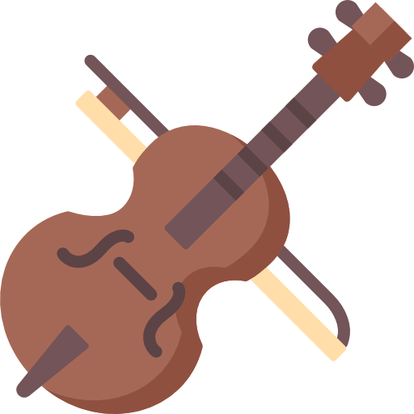

# Cello
A toy music player made in the [Godot](https://godotengine.org/) game engine

## Features
- Written entirely in Godot, as in no platform specific dependencies,  
  besides the couple engine modules it uses.

- Zip Archive Support (Read tracks directly from archives)

- Playlist Support

### Screenshots
- [Visualizer](https://cdn.discordapp.com/attachments/635625925748457482/923598671709372456/unknown.png)
- [Album View](https://cdn.discordapp.com/attachments/781077863981776971/923627802643812372/unknown.png)
- [Settings View](https://cdn.discordapp.com/attachments/781077863981776971/923627994629681202/unknown.png)
- [Playlist Creator](https://i.imgur.com/bQPssgZ.png)

## Installation
Download the binary for your platform from the releases page (x86_64 for Linux/X11 or .exe for Windows)
and the .pck file to store along side it.

## TODO:
- Keyboard navigation
- Cleanup code and make it less error vunerable
